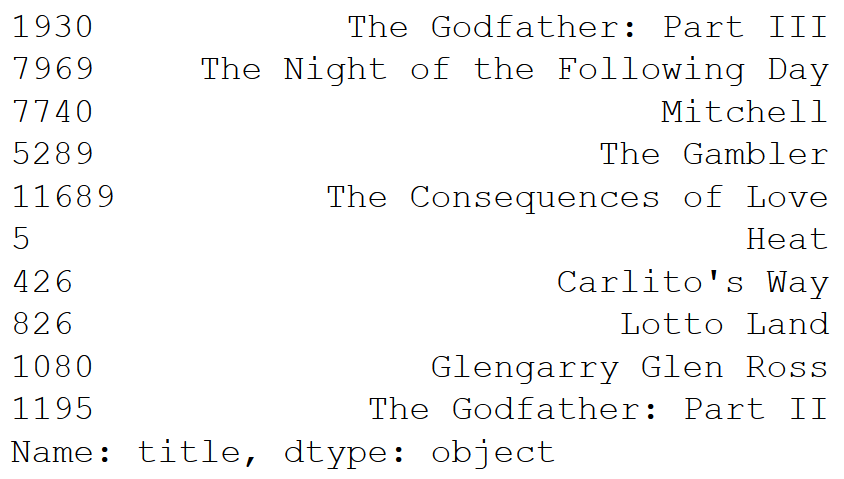

Recommendation systems tutorial on a sample movies db.

### Libraries
* pandas
* numpy
* warnings
* matplotlib
* seaborn
* scikit-learn

### Code
#### Simple recommender
##### Import libs
```python
import pandas as pd
import numpy as np
import matplotlib.pyplot as plt
import seaborn as sns
import warnings
warnings.filterwarnings('ignore')
```

##### Import data
```python
ratings = pd.read_csv('./src/ratings.csv', sep=',')
movies = pd.read_csv('./src/movies.csv', sep=',')
```

##### Processing data
```python
# creates dataframe
df = pd.merge(ratings, movies, on='movieId')

# computes mean rating for every movie
rated = pd.DataFrame(df.groupby('title')['rating'].mean())

# computes number of ratings for every movie
rated['number_of_ratings'] = df.groupby('title')['rating'].count()
```

##### Visualizing data
```python
# histogram of average ratings
%matplotlib inline
rated['rating'].hist(bins=50)
```


```python
# histogram of number of ratings
rated['number_of_ratings'].hist(bins=50)
```


```python
# numbers vs. means
sns.jointplot(x='rating', y='number_of_ratings', data=rated)
```


##### Creating a ranking system
The score provides a base to the ranking system.
```python
# creates a global average score
C = rated['rating'].mean()

# identifies required minimum number of ratings
m = rated['number_of_ratings'].quantile(0.90)

# identifies qualified movies
q_movies = rated.copy().loc[rated['number_of_ratings'] >= m]

# creates function that computes the weighted rating of each movie
def weighted_rating(x, m=m, C=C):
    v = x['number_of_ratings']
    R = x['rating']
    # based on the IMDB formula
    return (v/(v+m) * R) + (m/(m+v) * C)

# applies it for new score column on qualified movies
q_movies['score'] = q_movies.apply(weighted_rating, axis=1)

# sorts on score
q_movies = q_movies.sort_values('score', ascending=False)
```
Outputs the top15 sorted list of movies by score (a weighted rating according to the IMDB formula):


##### Exploiting correlation data
The correlation provides a way to identify similar movies.
```python
# rating by user for every movie matrix
movie_matrix = df.pivot_table(index='userId', columns='title', values='rating')

# users rating for the movie "Forrest Gump"
forrest_gump_ratings = movie_matrix['Forrest Gump (1994)']

# pointing movies similar to "Forrest Gump"
movies_like_forrest_gump = movie_matrix.corrwith(forrest_gump_ratings)
corr_forrest_gump = pd.DataFrame(movies_like_forrest_gump, columns=['Correlation'])
corr_forrest_gump.dropna(inplace=True)

# joining the number of ratings
corr_forrest_gump = corr_forrest_gump.join(rated['number_of_ratings'])

# sorted by correlation with more than 50 ratings registered
corr_forrest_gump[corr_forrest_gump['number_of_ratings']>50].sort_values('Correlation', ascending=False).head()
```
Outputs the top5 sorted list of corresponding movies to the example "Forrest Gump (1994)" by correlation with more than 50 ratings registered:


#### Content-based recommender
A multi-parameters based recommender.
##### Plot description
Pairwise cosine similarity scores for all movies based on their plot descriptions.
```python
# import data
metadata = pd.read_csv('./src/movies_metadata.csv', low_memory=False)

# replace NaN with empty string
metadata['overview'] = metadata['overview'].fillna('')
```
Computes tf-idf
```python
# import function from scikit-learn
from sklearn.feature_extraction.text import TfidfVectorizer

# define object
tfidf = TfidfVectorizer(stop_words='english')

# construct matrix
tfidf_matrix = tfidf.fit_transform(metadata['overview'])
tfidf_matrix.shape
```
Showing that 45,466 movies have 75,827 different words & vocabularies.  
Then computes cosine similarity with linear_kernel as tf-idf already computed dot products:
```python
from sklearn.metrics.pairwise import linear_kernel
cosine_sim = linear_kernel(tfidf_matrix, tfidf_matrix)
cosine_sim.shape
```
Top10 similar movies function
```python
# identify the index of movie with its name
indices = pd.Series(metadata.index, index=metadata['title']).drop_duplicates()

# function
def get_recommendation(title, cosine_sim=cosine_sim):
    # get the index
    idx = indices[title]
    
    # get the similarity
    sim_scores = list(enumerate(cosine_sim[idx]))
    
    # sort
    sim_scores = sorted(sim_scores, key=lambda x:x[1], reverse=True)
    
    # get scores of top10 without self
    sim_scores = sim_scores[1:11]
    
    # get the indices
    movie_indices = [i[0] for i in sim_scores]
    
    # get top10
    return metadata['title'].iloc[movie_indices]
```
Finds similar movies by cosine similarity of plot descriptions
```python
get_recommendation('The Dark Knight Rises')
```
Outputs the top10 sorted list of corresponding movies to the example "The Dark Knight Rises" by cosine similarity on their overview:


#### Enriched content based recommender
Increases the number of metadata used : the 3 top actors, the director, related genres, and the movie plot keywords.

```python
# imports data
credits = pd.read_csv('./src/small_credits.csv')
keywords = pd.read_csv('./src/keywords.csv')

# removes rows with bad IDs - some dates would raise a ValueError on conversion to int type otherwise
metadata = metadata.drop([19730, 29503, 35587])

# converts ids to int for proper merging
keywords['id'] = keywords['id'].astype('int')
credits['id'] = credits['id'].astype('int')
metadata['id'] = metadata['id'].astype('int')

# merges new data to dataframe
metadata = metadata.merge(credits, on='id')
metadata = metadata.merge(keywords, on='id')

# converts stringified data to exploitable python objects
from ast import literal_eval
features = ['cast', 'crew', 'keywords', 'genres']
for feature in features:
    metadata[feature] = metadata[feature].apply(literal_eval)

# function to get director name from crew features, if not listed return NaN
def get_director(x):
    for i in x:
        if i['job'] == 'Director':
            return i['name']
        return np.nan

# function to get top3 of cast, keywords & genres
def get_list(x):
    if isinstance(x, list):
        names = [i['name'] for i in x]
        # returns top3 only
        if len(names) > 3:
            names = names[:3]
        return names
    # returns emply list if missing data
    return []

# applies last 2 functions
metadata['director'] = metadata['crew'].apply(get_director)

features = ['cast', 'keywords', 'genres']
for feature in features:
    metadata[feature] = metadata[feature].apply(get_list)

# function to convert names & keywords to lowercase+spaceless to better feed the vectorizer
def clean_data(x):
    if isinstance(x, list):
        return [str.lower(i.replace(" ", "")) for i in x]
    else:
        # return empty string if director does not exist
        if isinstance(x, str):
            return str.lower(x.replace(" ", ""))
        else:
            return ''

# applies last function
features = ['cast', 'keywords', 'director', 'genres']
for feature in features:
    metadata[feature] = metadata[feature].apply(clean_data)

# function to create metadata soup to feed vectorizer
def create_soup(x):
    return (
        ' '.join(x['keywords'])
        + ' '
        + ' '.join(x['cast'])
        + ' '
        + ' '.join(x['director'])
        + ' '
        + ' '.join(x['genres'])
    )

# creates new soup feature
metadata['soup'] = metadata.apply(create_soup, axis=1)
```

##### Plot description
Uses CountVector() instead of TF-IDF to avoid down-weight of the actor/director's presence through IDF component.

```python
# import CountVectorizer and create the count matrix
from sklearn.feature_extraction.text import CountVectorizer

count = CountVectorizer(stop_words='english')
count_matrix = count.fit_transform(metadata['soup'])
```
Showing that 58,204 vocabularies from the metadata dataset were fed to CountVector() function

```python
# cosine similarity
from sklearn.metrics.pairwise import cosine_similarity
cosine_sim2 = cosine_similarity(count_matrix, count_matrix)

# reset index & reverse mapping
metadata = metadata.reset_index()
indices = pd.Series(metadata.index, index=metadata['title'])

# application
get_recommendation('The Godfather', cosine_sim2)
```
Outputs the top10 sorted list of corresponding movies to the example "The Godfather" by cosine similarity on overviews, cast, keywords, director & genres:
