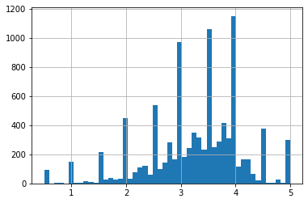
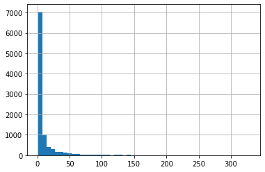
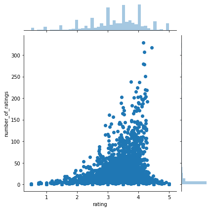
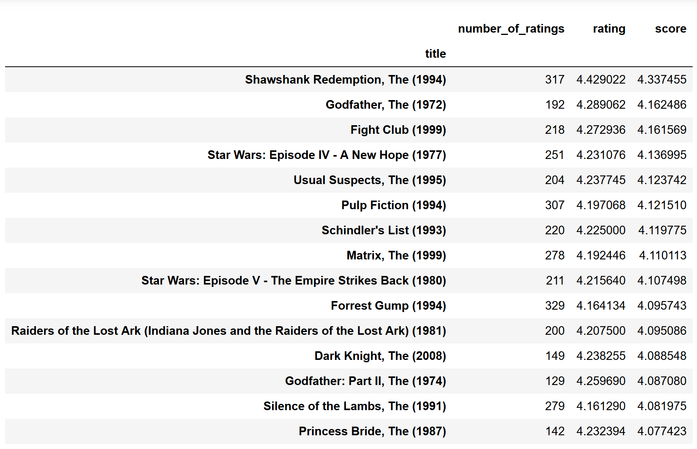
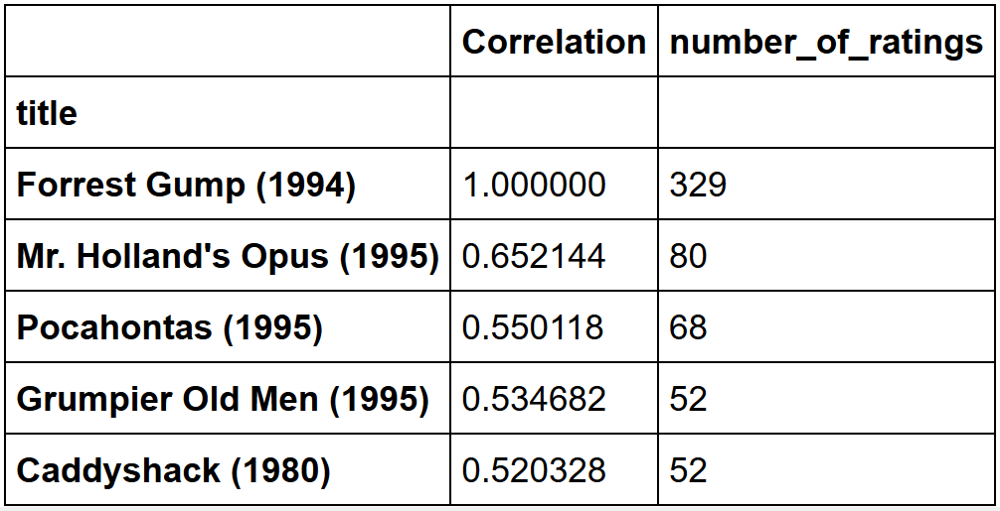
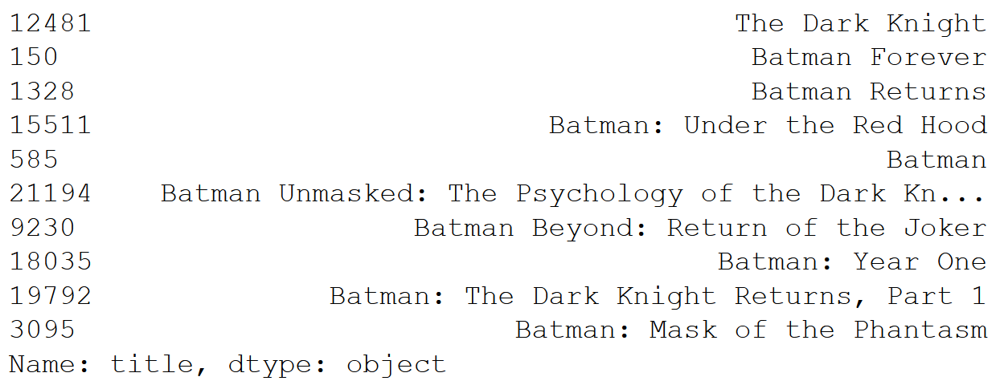

Recommendation systems tutorial on a sample movies db.

### libraries
* pandas
* numpy
* warnings
* matplotlib
* seaborn

### code
#### simple recommender
##### import libs
```python
import pandas as pd
import numpy as np
import matplotlib.pyplot as plt
import seaborn as sns
import warnings
warnings.filterwarnings('ignore')
```

##### import data
```python
ratings = pd.read_csv('./src/ratings.csv', sep=',')
movies = pd.read_csv('./src/movies.csv', sep=',')
```

##### processing data
```python
# creates dataframe
df = pd.merge(ratings, movies, on='movieId')

# computes mean rating for every movie
rated = pd.DataFrame(df.groupby('title')['rating'].mean())

# computes number of ratings for every movie
rated['number_of_ratings'] = df.groupby('title')['rating'].count()
```

##### visualizing data
```python
# histogram of average ratings
%matplotlib inline
rated['rating'].hist(bins=50)
```


```python
# histogram of number of ratings
rated['number_of_ratings'].hist(bins=50)
```


```python
# numbers vs. means
sns.jointplot(x='rating', y='number_of_ratings', data=rated)
```


##### creating a ranking system
the score provides a base to the ranking system.'
```python
# creates a global average score
C = rated['rating'].mean()

# identifies required minimum number of ratings
m = rated['number_of_ratings'].quantile(0.90)

# identifies qualified movies
q_movies = rated.copy().loc[rated['number_of_ratings'] >= m]

# creates function that computes the weighted rating of each movie
def weighted_rating(x, m=m, C=C):
    v = x['number_of_ratings']
    R = x['rating']
    # based on the IMDB formula
    return (v/(v+m) * R) + (m/(m+v) * C)

# applies it for new score column on qualified movies
q_movies['score'] = q_movies.apply(weighted_rating, axis=1)

# sorts on score
q_movies = q_movies.sort_values('score', ascending=False)
```


##### exploiting correlation data
the correlation provides a way to identify similar movies.
```python
# rating by user for every movie matrix
movie_matrix = df.pivot_table(index='userId', columns='title', values='rating')

# users rating for the movie "Forrest Gump"
forrest_gump_ratings = movie_matrix['Forrest Gump (1994)']

# pointing movies similar to "Forrest Gump"
movies_like_forrest_gump = movie_matrix.corrwith(forrest_gump_ratings)
corr_forrest_gump = pd.DataFrame(movies_like_forrest_gump, columns=['Correlation'])
corr_forrest_gump.dropna(inplace=True)

# joining the number of ratings
corr_forrest_gump = corr_forrest_gump.join(rated['number_of_ratings'])

# sorted by correlation with more than 50 ratings registered
corr_forrest_gump[corr_forrest_gump['number_of_ratings']>50].sort_values('Correlation', ascending=False).head()
```


#### content-based recommender
##### plot description based recommender
pairwise cosine similarity scores for all movies based on their plot descriptions.
```python
# import data
metadata = pd.read_csv('./src/movies_metadata.csv', low_memory=False)

# replace NaN with empty string
metadata['overview'] = metadata['overview'].fillna('')
```
computes tf-idf
```python
# import function from scikit-learn
from sklearn.feature_extraction.text import TfidfVectorizer

# define object
tfidf = TfidfVectorizer(stop_words='english')

# construct matrix
tfidf_matrix = tfidf.fit_transform(metadata['overview'])
tfidf_matrix.shape
```
45466 movies have 75827 different words & vocabularies.<\n>
computes cosine similarity with linear_kernel as tf-idf already computed dot products
```python
from sklearn.metrics.pairwise import linear_kernel
cosine_sim = linear_kernel(tfidf_matrix, tfidf_matrix)
cosine_sim.shape
```
top10 similar movies function
```python
# identify the index of movie with its name
indices = pd.Series(metadata.index, index=metadata['title']).drop_duplicates()

# function
def get_recommendation(title, cosine_sim=cosine_sim):
    # get the index
    idx = indices[title]
    
    # get the similarity
    sim_scores = list(enumerate(cosine_sim[idx]))
    
    # sort
    sim_scores = sorted(sim_scores, key=lambda x:x[1], reverse=True)
    
    # get scores of top10 without self
    sim_scores = sim_scores[1:11]
    
    # get the indices
    movie_indices = [i[0] for i in sim_scores]
    
    # get top10
    return metadata['title'].iloc[movie_indices
```
finds similar movies by cosine similarity of plot descriptions
```python
get_recommendation('The Dark Knight Rises')
```


#### collaborative filtering recommender